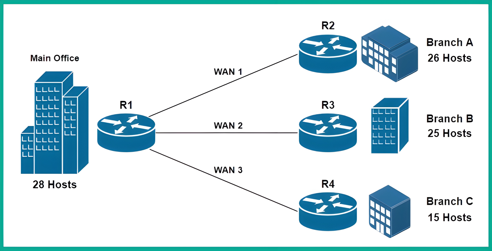

# 🌐 IPv4 Subnetting & VLSM Interactive Guide


<p align="center">
  
  
  
  
</p>

<p align="center">
  <a href="https://hashimthepassionate.github.io/ipv4-subnetting-guide/">
    
  </a>
</p>

A comprehensive, interactive educational resource for mastering IPv4 subnetting and Variable Length Subnet Masking (VLSM). Perfect for networking students, IT professionals, and aspiring network engineers.



## 🎯 Project Goal

This interactive web-based guide helps you master the essential networking concepts of IPv4 subnetting and VLSM through:

✅ **Visual Learning** - Beautiful diagrams and color-coded examples  
✅ **Practical Examples** - Real-world network scenarios  
✅ **Interactive Tools** - Calculators and validators  
✅ **Step-by-Step Tutorials** - Easy-to-follow progression  
✅ **Comprehensive Coverage** - From basics to advanced VLSM  

## ✨ Features

### 📚 Educational Content

- **Complete IPv4 Fundamentals** - Understanding IP addressing and classes
- **Subnetting Mastery** - Learn to divide networks efficiently
- **VLSM Techniques** - Optimize IP allocation with variable-length masks
- **Binary Conversion** - Master the math behind networking
- **Network Design** - Plan scalable addressing schemes

### 🎨 Visual Learning Tools

- **Interactive Diagrams** - Network topology visualizations
- **Color-Coded Examples** - Easy-to-understand subnet breakdowns
- **Binary Visualizations** - See how bits work together
- **Usage Bars** - Visual representation of IP utilization
- **Responsive Design** - Works perfectly on all devices

### 🔧 Interactive Calculators

1. **Subnet Calculator**
   - Calculate subnet requirements based on host count
   - Automatically determine subnet mask and CIDR notation
   - Display usable IPs and network/host bits

2. **IP Address Validator**
   - Verify IP address format
   - Identify IP class (A, B, C, D, E)
   - Distinguish between public and private addresses
   - Convert to binary representation

3. **Binary Converter**
   - Convert decimal to binary (0-255)
   - Visual bit breakdown
   - Power-of-2 explanations

### 🌓 Dark Mode Support

Automatic dark mode that adapts to your system preferences for comfortable learning day or night.

## 🚀 Quick Start

### Option 1: Direct Download

1. **Clone or Download** this repository:
   ```bash
   git clone https://github.com/HashimThePassionate//ipv4-subnetting-guide.git
   ```

2. **Open** `index.html` in your web browser

3. **Start Learning!** No installation or setup required

### Option 2: Live Server (Recommended for Development)

1. **Install VS Code** and the "Live Server" extension

2. **Open** the project folder in VS Code

3. **Right-click** on `index.html` and select "Open with Live Server"

4. **Access** at `http://localhost:5500`

## 📖 How to Use

### For Beginners

1. **Start with Introduction** - Learn what subnetting is and why it matters
2. **Follow Step-by-Step** - Work through each section sequentially
3. **Use Calculators** - Experiment with the interactive tools
4. **Practice Examples** - Try the included scenario

### For Advanced Users

1. **Jump to VLSM Section** - Advanced optimization techniques
2. **Reference Tables** - Quick lookup for subnet masks
3. **Design Examples** - Real-world network planning

### Navigation

- Use the **sticky navigation bar** to jump between sections
- Click on **interactive elements** to see details
- Try the **calculators** with different values
- Observe **animated diagrams** as you scroll

## 📂 Project Structure

```
subnetting-guide/
├── index.html              # Main HTML file with all content
├── css/
│   └── styles.css          # Complete styling with dark mode
├── js/
│   └── scripts.js          # Interactive calculators and animations
├── images/
│   └── 01.png             # Network topology diagram
├── README.md              # This file
└── LICENSE                # MIT License
```

## 🎓 Learning Path

### Step 1: IPv4 Block Selection
- Understand IP address classes
- Calculate network requirements
- Choose appropriate address blocks

### Step 2: Creating Subnets
- Learn bit borrowing techniques
- Calculate subnet masks
- Determine number of subnets

### Step 3: Assigning Subnets
- Allocate subnets to networks
- Calculate usable IP ranges
- Understand network and broadcast addresses

### Step 4: VLSM Implementation
- Optimize IP allocation
- Minimize address waste
- Plan for future growth

## 🛠️ Technologies Used

- **HTML5** - Semantic markup and structure
- **CSS3** - Modern styling with CSS Grid and Flexbox
- **JavaScript (ES6+)** - Interactive features and calculations
- **Google Fonts** - Roboto, Open Sans, and Fira Code
- **Responsive Design** - Mobile-first approach
- **Accessibility** - ARIA labels and semantic HTML

## 📱 Browser Compatibility

- ✅ Chrome/Edge (latest)
- ✅ Firefox (latest)
- ✅ Safari (latest)
- ✅ Opera (latest)
- ✅ Mobile browsers (iOS Safari, Chrome Mobile)

## 🎨 Customization

### Changing Colors

Edit the CSS variables in `css/styles.css`:

```css
:root {
    --accent-color: #007BFF;      /* Primary color */
    --accent-hover: #0056B3;      /* Hover state */
    --bg-color: #FFFFFF;          /* Background */
    /* ... more variables ... */
}
```

### Adding More Examples

Add new sections in `index.html` following the existing structure:

```html
<section id="your-section" class="content-section">
    <h2>Your Section Title</h2>
    <!-- Your content here -->
</section>
```

## 🤝 Contributing

Contributions are welcome! Here's how you can help:

1. **Fork** the repository
2. **Create** a feature branch (`git checkout -b feature/AmazingFeature`)
3. **Commit** your changes (`git commit -m 'Add some AmazingFeature'`)
4. **Push** to the branch (`git push origin feature/AmazingFeature`)
5. **Open** a Pull Request

### Ideas for Contribution

- 📝 Add more examples and scenarios
- 🎨 Improve visual designs
- 🔧 Create additional calculators (CIDR calculator, subnet splitter, etc.)
- 🌍 Add translations to other languages
- 📊 Add more network diagrams
- ✨ Enhance animations and interactions

## 📝 License

This project is licensed under the **MIT License** - see the [LICENSE](LICENSE) file for details.

## 👨‍💻 Author

**Hashim**

- 🌐 GitHub: [@HashimThePassionate](https://github.com/HashimThePassionate/)
- 📧 Email: hashiimtahir@example.com

## 🙏 Acknowledgments

- Inspired by real-world networking scenarios
- Built for the networking education community
- Thanks to all contributors and users

## 📚 Additional Resources

### Learn More About Networking

- [Cisco Networking Academy](https://www.netacad.com/)
- [Subnetting Practice](https://subnettingpractice.com/)
- [RFC 1918 - Private IP Addresses](https://tools.ietf.org/html/rfc1918)
- [CIDR Notation Guide](https://en.wikipedia.org/wiki/Classless_Inter-Domain_Routing)

### Tools & References

- [IP Subnet Calculator](https://www.calculator.net/ip-subnet-calculator.html)
- [Visual Subnet Calculator](https://www.davidc.net/sites/default/subnets/subnets.html)
- [Network Chuck YouTube Channel](https://www.youtube.com/c/NetworkChuck)

## 🐛 Bug Reports

Found a bug? Please open an issue with:

- Description of the bug
- Steps to reproduce
- Expected vs actual behavior
- Screenshots (if applicable)
- Browser and OS information

## ⭐ Show Your Support

If this project helped you learn subnetting, please consider:

- ⭐ **Starring** this repository
- 🍴 **Forking** and contributing
- 📢 **Sharing** with others
- 💬 **Providing feedback**

## 📈 Future Enhancements

- [ ] Add IPv6 subnetting guide
- [ ] Create subnet quiz/practice mode
- [ ] Add video tutorials
- [ ] Implement subnet visualizer tool
- [ ] Add network troubleshooting guide
- [ ] Create mobile app version
- [ ] Add multi-language support

<div align="center">

**Made with ❤️**

⭐ **Star this repo if you found it helpful!** ⭐

[Report Bug](https://github.com/HashimThePassionate/ipv4-subnetting-guide/issues) · [Request Feature](https://github.com/HashimThePassionate/ipv4-subnetting-guide/issues) 

</div>
